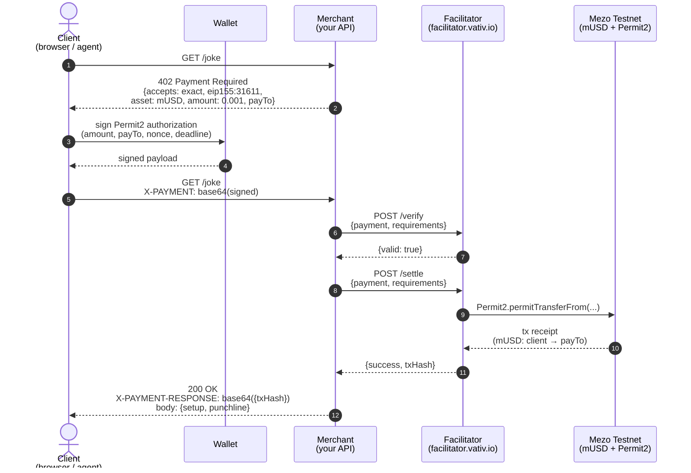

# x402 on Mezo — Architecture

The full request flow from unauthenticated `GET` to settled on-chain payment
and content delivery, in one user interaction.

## Sequence diagram

(Source: [`diagrams/x402-sequence.md`](diagrams/x402-sequence.md).)

## Who runs what

| Component | Runs in | Who operates it |
|---|---|---|
| **Client** | Browser, CLI, AI agent | End user (or their agent) |
| **Wallet** | Browser extension, embedded signer | End user |
| **Merchant** | Your server — Node/Python/Go/etc | You |
| **Facilitator** | `facilitator.vativ.io` for Mezo Testnet | We host it free |
| **Chain** | Mezo Testnet, chain 31611 | Mezo Foundation |

**You only build the merchant.** Client libraries (`@x402/fetch`, wagmi
connectors) handle wallet interaction. The facilitator handles all chain
interaction. Your code implements business logic and declares prices.

## What the merchant code does

The `@x402/express` middleware abstracts the protocol into a declarative
config. You declare:

- Which routes are paywalled
- What scheme, chain, asset, amount per route
- Where the payment goes (`payTo`)
- Optional: description, mime type, max timeout

The middleware handles:

1. Returning `402 Payment Required` with the correct `accepts` envelope on
   unpaid requests
2. Parsing `X-PAYMENT` header from retry requests
3. Calling the facilitator's `/verify` endpoint to validate the signature
4. Calling the facilitator's `/settle` endpoint to execute the transfer
5. Injecting `X-PAYMENT-RESPONSE` into the success response with the tx hash
6. Only then invoking your route handler

The route handler runs only after successful settlement. You never check
headers, never call the facilitator manually, never touch a chain library.

## Why the facilitator exists

The facilitator is the only piece between your merchant and the blockchain.
It exists so that:

- **You don't need to hold gas** — the facilitator pays gas and is
  reimbursed via the settlement transfer itself (or runs as a public good on
  testnet, as ours does)
- **You don't need a Web3 library** in your merchant — no `viem`, no
  `ethers`, no RPC configuration, no private key management
- **You don't need to track nonces or wait for confirmations** — the
  facilitator handles Permit2 nonce management and returns only on finality
- **You can swap chains** by changing one config line — the facilitator
  abstracts the on-chain implementation details

## The 50-line merchant

The [`starter/`](../starter/) directory has the minimal merchant: one route,
one JSON file, one paymentMiddleware config. It runs against the hosted
facilitator and settles real testnet mUSD transfers. It's the code you'll
see in the webinar live demo.

## See also

- [`what-is-x402.md`](what-is-x402.md) — the protocol
- [`why-mezo.md`](why-mezo.md) — why mUSD on Mezo
- [`diagrams/x402-sequence.md`](diagrams/x402-sequence.md) — the diagram with
  step-by-step narration
- [`../starter/README.md`](../starter/README.md) — build your own in 5
  minutes
