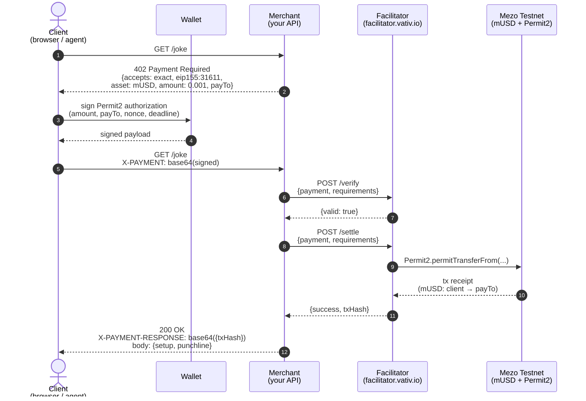

# x402 Payment Flow — Sequence Diagram

The full round trip: an unauthenticated `GET` becomes a settled on-chain
payment and a `200 OK` with the content, in one user interaction.

## Step-by-step

1. **GET /joke** — unauthenticated request. The client has no idea payment is
   required yet.
2. **402 Payment Required** — merchant returns the x402 envelope: which
   scheme, which chain, which asset, how much, and where to pay it.
3. **Wallet signs** — client's wallet signs a Permit2 authorization. This is
   an off-chain signature, no gas yet.
4. **Retry with `X-PAYMENT`** — client sends the same request again with the
   signed authorization base64-encoded in the header.
5. **`/verify`** — merchant asks the facilitator "is this signature valid
   for this amount to this address?" Cheap, no chain touch.
6. **`/settle`** — merchant asks the facilitator to execute. The facilitator
   submits `Permit2.permitTransferFrom(...)` on-chain, paying gas on the
   merchant's behalf.
7. **On-chain transfer** — Mezo Testnet processes the Permit2 call, moving
   mUSD from the client's wallet to the merchant's `payTo` address. ~2s
   finality.
8. **200 OK** — the merchant returns the actual content plus
   `X-PAYMENT-RESPONSE` containing the tx hash so the client can verify on
   the explorer.

## What the merchant actually builds

Steps 2, 5, 6, 8. The `paymentMiddleware` from `@x402/express` wraps them
into a single declarative config. You declare what to charge for which
route; the middleware handles 402 generation, verification call, settlement
call, and response header injection.

**You do NOT build:** wallet UI, Permit2 signing, chain interaction, gas
payment, signature verification, on-chain call. The client libraries do the
wallet side; the facilitator does the chain side.

## Used in

- `docs/architecture.md` — reference doc
- `webinar/slides/` — slide 5 (the "how it works" diagram)
- `starter/README.md` — linked from "what's next"
